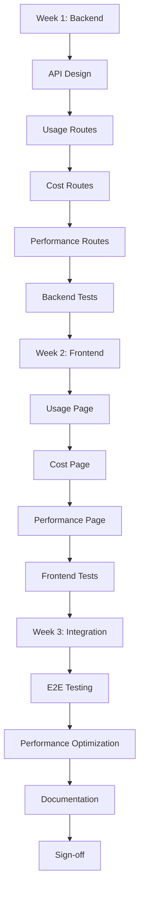

# Phase 3 Documentation

**Phase:** Core Analytics Pages
**Duration:** 3 weeks (Weeks 9-11)
**Status:** Ready to Begin

---

## Documentation Overview

This folder contains all documentation for Phase 3 implementation of the Agent Observability Platform.

### Primary Documents

1. **[CLAUDE.md](../../CLAUDE.md)** (Root level)
   - 📖 **700+ line comprehensive implementation guide**
   - Complete step-by-step workflow for Phase 3
   - Sub-agent invocation patterns
   - Code examples and templates
   - Testing strategies
   - Troubleshooting guide
   - **START HERE** for full implementation

2. **[PHASE3_QUICK_START.md](./PHASE3_QUICK_START.md)**
   - ⚡ Quick reference guide
   - Day-by-day checklist
   - Sub-agent invocation cheatsheet
   - Code snippets
   - Testing commands
   - **USE THIS** for quick lookups

3. **[API_SPEC.md](./API_SPEC.md)**
   - 📋 Complete API specification
   - All 12 endpoints documented
   - Request/response schemas
   - Error codes
   - Cache strategies
   - Performance targets
   - **REFERENCE THIS** during implementation

---

## What Gets Built in Phase 3

### Backend: Query Service Extensions

**New Route Files:**
```
backend/query/app/routes/
├── usage.py        # 4 endpoints
├── cost.py         # 4 endpoints (+ PUT for budget)
└── performance.py  # 4 endpoints
```

**Total:** 12 new API endpoints

### Frontend: Analytics Pages

**Updated Pages:**
```
frontend/app/dashboard/
├── usage/page.tsx       # Replace placeholder
├── cost/page.tsx        # Replace placeholder
└── performance/page.tsx # Replace placeholder
```

**Components:**
- 12 KPI Cards (4 per page)
- 10+ Recharts visualizations
- 3 Time range selectors
- 3 Data tables
- Loading states (Skeleton)
- Error states (Alert)

### Testing

**Backend Tests:**
- `backend/query/tests/test_usage.py` (6 tests)
- `backend/query/tests/test_cost.py` (6 tests)
- `backend/query/tests/test_performance.py` (6 tests)

**Frontend Tests:**
- `frontend/app/dashboard/usage/__tests__/page.test.tsx` (3 tests)
- `frontend/app/dashboard/cost/__tests__/page.test.tsx` (3 tests)
- `frontend/app/dashboard/performance/__tests__/page.test.tsx` (3 tests)

**Total:** 27 tests

---

## Implementation Workflow

### Phase 3 Roadmap



### Sub-Agent Strategy

**Agents to Use:**
1. **fullstack-api-designer** - API specification
2. **general-purpose** - Backend routes & frontend pages
3. **fullstack-integration-tester** - Test suites
4. **Explore** - Codebase exploration (when needed)

**Virtual Specialization:**
We achieve "specialized agents" through carefully crafted prompts to the general-purpose agent:
- FastAPI route builder prompts
- Recharts dashboard builder prompts
- TimescaleDB query optimizer prompts

See CLAUDE.md "Sub-Agent Strategy" section for detailed invocation patterns.

---

## Key Technologies

**Backend:**
- FastAPI (routes)
- TimescaleDB (time-series queries)
- Redis (caching)
- Pydantic (models)
- pytest (testing)

**Frontend:**
- Next.js 14 (App Router)
- React 18
- Recharts (visualizations)
- shadcn/ui (components)
- TanStack Query (data fetching)
- TypeScript (strict mode)

**Database Queries:**
- time_bucket() for aggregations
- percentile_cont() for P50/P95/P99
- Continuous aggregates (future optimization)
- Proper indexes for performance

---

## Performance Targets

| Metric | Target | Phase 2 Baseline |
|--------|--------|------------------|
| Overview endpoints | < 50ms P95 | N/A |
| Chart data endpoints | < 100ms P95 | ~80ms (home KPIs) |
| Complex aggregations | < 200ms P95 | N/A |
| Cache hit rate | > 80% | ~85% |
| Frontend load time | < 2s | ~1.5s |

---

## Acceptance Criteria

### Must Pass Before Moving to Phase 4

**Backend:**
- [x] 12 API endpoints created
- [x] All endpoints return valid JSON
- [x] Query performance < 100ms P95
- [x] Redis caching working (5min TTL)
- [x] 18/18 backend tests passing
- [x] No errors in service logs

**Frontend:**
- [x] 3 pages fully functional
- [x] All charts rendering correctly
- [x] Time range selectors working
- [x] Loading states implemented
- [x] Error handling graceful
- [x] 9/9 frontend tests passing
- [x] Responsive on all screen sizes

**Integration:**
- [x] E2E data flow working
- [x] All time range filters working
- [x] No console errors
- [x] Cache invalidation correct

**Documentation:**
- [x] PHASE3_COMPLETE.md created
- [x] API endpoints documented
- [x] Usage examples provided
- [x] Screenshots included

---

## Documents That Will Be Created

During Phase 3 implementation, these documents will be generated:

1. **PHASE3_COMPLETE.md**
   - Complete implementation report
   - All files created/modified
   - Testing results
   - Performance benchmarks
   - Known issues (if any)
   - Screenshots of all 3 pages

2. **PHASE3_SUMMARY.md**
   - Concise reference
   - Quick commands
   - API endpoint list
   - Testing commands

3. **TESTING_REPORT.md**
   - Test coverage results
   - All 27 test descriptions
   - Edge cases tested
   - Coverage percentage

4. **PERFORMANCE_BENCHMARKS.md**
   - Query execution times
   - Cache hit rates
   - Frontend load times
   - Optimization recommendations

---

## Useful Commands

### Start Services
```bash
cd "/Users/pk1980/Documents/Software/Agent Monitoring"
docker-compose up -d
docker-compose logs -f query
```

### Run Backend Tests
```bash
cd backend/query
pytest tests/ -v
pytest tests/test_usage.py -v
pytest tests/test_cost.py -v
pytest tests/test_performance.py -v
pytest tests/ --cov=app --cov-report=html
```

### Run Frontend Tests
```bash
cd frontend
npm test
npm test -- --coverage
npm test -- app/dashboard/usage
```

### Test API Endpoints
```bash
export WORKSPACE_ID="your-workspace-id-here"

# Usage Analytics
curl "http://localhost:8003/api/v1/usage/overview?range=24h" \
  -H "X-Workspace-ID: $WORKSPACE_ID"

# Cost Management
curl "http://localhost:8003/api/v1/cost/overview?range=30d" \
  -H "X-Workspace-ID: $WORKSPACE_ID"

# Performance Monitoring
curl "http://localhost:8003/api/v1/performance/overview?range=24h" \
  -H "X-Workspace-ID: $WORKSPACE_ID"
```

### Check Performance
```bash
# Query execution time
curl -w "@curl-format.txt" -o /dev/null -s \
  "http://localhost:8003/api/v1/usage/overview?range=24h" \
  -H "X-Workspace-ID: $WORKSPACE_ID"

# Cache check
docker exec agent_obs_redis redis-cli KEYS "usage_*"
docker exec agent_obs_redis redis-cli GET "usage_overview:$WORKSPACE_ID:24h"
```

### Database Queries
```bash
# Connect to TimescaleDB
docker exec -it agent_obs_timescaledb psql -U postgres -d agent_observability

# Check trace count
SELECT COUNT(*) FROM traces;

# Check workspace data
SELECT workspace_id, COUNT(*) as trace_count
FROM traces
GROUP BY workspace_id;

# Test percentile query
SELECT
  percentile_cont(0.50) WITHIN GROUP (ORDER BY latency_ms) AS p50,
  percentile_cont(0.95) WITHIN GROUP (ORDER BY latency_ms) AS p95,
  percentile_cont(0.99) WITHIN GROUP (ORDER BY latency_ms) AS p99
FROM traces
WHERE workspace_id = 'your-workspace-id';
```

---

## Related Documentation

**Phase 0-2 Docs:**
- [Phase 0 Complete](../phase0/PHASE_0_COMPLETE.md) - Foundation
- [Phase 1 Verification](../phase1/PHASE1_VERIFICATION_REPORT.md) - Core Backend
- [Phase 2 Complete](../phase2/PHASE2_COMPLETE.md) - Query Service + Home Dashboard

**Root Level:**
- [PLAN.md](../../PLAN.md) - Complete 6-phase roadmap
- [CLAUDE.md](../../CLAUDE.md) - Phase 3 implementation guide
- [docker-compose.yml](../../docker-compose.yml) - All services configuration

**API Docs:**
- [API Specification](./API_SPEC.md) - All 12 Phase 3 endpoints
- [Database Schema](../database-schema-design.md) - TimescaleDB schema

---

## Support & Troubleshooting

### Common Issues

**Problem:** "X-Workspace-ID header required"
**Solution:** Ensure `X-Workspace-ID` header is provided in all API requests

**Problem:** Charts not rendering
**Solution:** Check browser console for errors, verify data format matches Recharts schema

**Problem:** Slow queries (> 100ms)
**Solution:** Add database indexes, check query execution plan with EXPLAIN ANALYZE

**Problem:** Cache not working
**Solution:** Verify Redis connection: `docker exec agent_obs_redis redis-cli PING`

**Problem:** Tests failing
**Solution:** Reset databases: `docker-compose down -v && docker-compose up -d`, wait 30s

### Getting Help

1. Check CLAUDE.md "Troubleshooting" section
2. Review API_SPEC.md for endpoint details
3. Check PLAN.md Phase 3 section for requirements
4. Inspect service logs: `docker logs agent_obs_query --tail 100`
5. Check database connectivity: `docker exec agent_obs_timescaledb pg_isready`

---

## Phase 3 Checklist

Copy this checklist to track progress:

```markdown
### Week 1: Backend
- [ ] Day 1: API Design complete (API_SPEC.md finalized)
- [ ] Day 2: Usage routes implemented (4 endpoints)
- [ ] Day 3: Cost routes implemented (4 endpoints + budget CRUD)
- [ ] Day 4: Performance routes implemented (4 endpoints with percentiles)
- [ ] Day 5: Backend tests (18/18 passing)

### Week 2: Frontend
- [ ] Day 6: Usage page complete (KPIs + LineChart + PieChart + Table)
- [ ] Day 7: Cost page complete (KPIs + AreaChart + BarChart + Alert)
- [ ] Day 8: Performance page complete (KPIs + Multi-line + AreaChart + Table)
- [ ] Day 9-10: Frontend tests (9/9 passing) + UI polish

### Week 3: Integration
- [ ] Day 11-12: E2E testing (all flows working)
- [ ] Day 13: Performance optimization (all queries < 100ms)
- [ ] Day 14: Documentation (all docs created)
- [ ] Day 15: Final check & sign-off (all criteria met)

### Overall
- [ ] 27/27 tests passing
- [ ] All 3 pages functional
- [ ] Query performance met
- [ ] Documentation complete
- [ ] Ready for Phase 4
```

---

**Last Updated:** 2025-10-22
**Next Phase:** Phase 4 - Advanced Features + AI (Quality, Safety, Impact pages)

**Status:** 🚀 Ready to begin Phase 3 implementation
